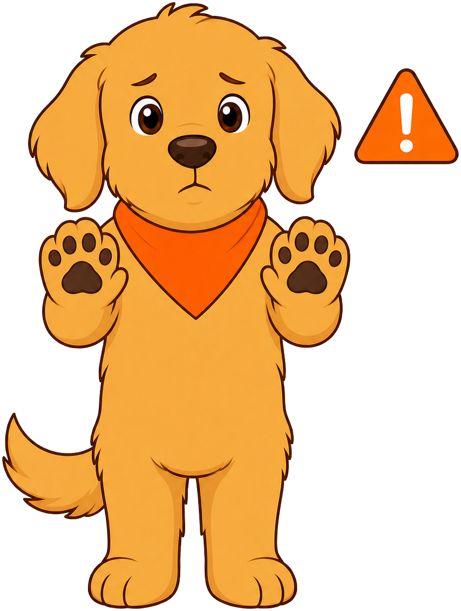

# Personal Safety And Violence Prevention

## Summary

This chapter addresses how technology and social media can cause harm and how to prevent and report it, how to recognize unhealthy relationships and set boundaries, and how to distinguish consent from coercion. Students also learn what individuals, peers, and school staff can do to reduce risk during an emergency, and how to recognize and report unsafe situations.

## Concepts Covered

1. Social Media Harm
2. Technology Harm Prevention Strategies
3. Reporting Online Harm
4. Unhealthy Relationship Recognition
5. Boundary-Setting
6. Seeking Support For Relationships
7. Safely Exiting Unsafe Relationships
8. Emergency Risk Reduction
9. Peer Actions During Emergencies
10. School-Staff Actions During Emergencies
11. Consent
12. Coercion
13. Consent Versus Coercion
14. Recognizing Unsafe Situations
15. Reporting Unsafe Situations

## Prerequisites

Builds on Trusted Adult from [Chapter 1: Foundations And Trusted Adults](../01-foundations-and-trusted-adults/index.md) and Managing Relationships / Respecting Peer Boundaries from [Chapter 3: Managing Emotions And Relationships](../03-managing-emotions-and-relationships/index.md).

---

!!! mascot-welcome "Staying Safe, Online And Off"
    { class="mascot-admonition-img" }
    Welcome back, friend. This chapter covers some serious topics: staying safe online, recognizing relationships that don't feel right, understanding the difference between someone agreeing freely and someone being pressured, and knowing what to do during an emergency or an unsafe situation. None of this is meant to scare you — it's meant to give you clear tools you can actually use.

## Social Media Harm

Technology connects people in powerful ways, but it can also be a source of harm. **Social media harm** refers to the negative effects that can come from how people use apps, games, texting, and websites to interact with each other. This isn't about technology being "bad" — it's about understanding the specific ways it can hurt someone so you can recognize and avoid it.

Social media and technology can cause harm in several common ways:

- **Cyberbullying** — using messages, posts, or images to repeatedly tease, threaten, embarrass, or exclude someone.
- **Oversharing personal information** — posting details like your address, school name, or daily schedule that a stranger could use to find or track you.
- **Unwanted contact from strangers** — being messaged by someone you don't know, especially an adult pretending to be a kid.
- **Sharing photos or videos without permission** — posting or forwarding an image of someone without asking first, which can feel like a real violation even without physical contact.
- **Believing everything you see** — false information, edited photos, or fake accounts can mislead people or damage a reputation.

Harm caused through a screen is still real harm. Feeling upset, embarrassed, scared, or unsafe because of something online is just as valid as feeling that way in person.

## Technology Harm Prevention Strategies

Recognizing that harm can happen is only the first step — the more useful skill is knowing how to reduce the chances of it happening to you. **Technology harm prevention strategies** are the practical habits and settings people use to stay safer while using apps, games, and websites.

Effective prevention strategies include:

1. **Use privacy settings** — set accounts to private so only approved people can see posts or contact you, and review settings regularly.
2. **Keep personal information private** — never share your full name, address, school, phone number, or location with people you only know online.
3. **Think before you post or send** — once something is online, it can be copied or shared beyond your control, even if you delete the original.
4. **Only connect with people you actually know** — treat friend requests or messages from strangers with caution.
5. **Set time and app limits with a trusted adult** — agreeing on appropriate apps and time limits prevents situations before they start.
6. **Pause before reacting to something upsetting** — step away from the screen before responding.

None of these strategies require being unfriendly or paranoid online — they're closer to looking both ways before crossing a street.

#### Diagram: Technology Safety Habit Checker

<iframe src="../../../../sims/technology-safety-habit-checker/main.html" width="100%" height="524px" scrolling="no"></iframe>

Technology Safety Habit Checker MicroSim

Type: microsim
**sim-id:** technology-safety-habit-checker 
**Library:** p5.js 
**Status:** Specified

Bloom Taxonomy: Apply (L3)
Bloom Taxonomy Verb: apply, demonstrate, practice

Learning objective: Students apply technology harm prevention strategies by evaluating a mock settings screen and identifying which settings are safe versus risky.

Canvas layout: Left (450px) mock app-settings screen with six toggles; right (200px) feedback panel and score.

Visual elements: Six toggle switches (account privacy, location sharing, who can message you, bio info, screen time limit, unknown contact requests), each showing "Safer" (green) or "Riskier" (orange).

Interactive controls: Click a toggle to flip it; "Check My Settings" reveals a score out of 6 with explanations; "Try a New Scenario" loads a new profile.

Default parameters: 3 safe and 3 risky settings pre-set.

Behavior: Toggling "location sharing" off shows "Strangers can't see where you are."

Instructional Rationale: Apply-level objective, so students manipulate realistic settings and see immediate feedback.

Implementation notes: p5.js; settings as objects with label, boolean state, and explanation strings.

## Reporting Online Harm

Prevention strategies reduce risk, but they can't prevent every problem — so knowing how to respond matters just as much. **Reporting online harm** means taking clear action when you experience or witness something harmful online, rather than staying silent or handling it alone.

Steps for reporting online harm effectively:

- **Don't respond or engage** — replying to a mean message or unknown contact often makes things worse.
- **Take a screenshot** — capturing the message or contact request creates evidence a trusted adult can use.
- **Block the person or account** — most apps let you block someone so they can no longer contact you.
- **Use the app's built-in report tool** — apps and games have a "Report" button for harmful content or behavior.
- **Tell a trusted adult right away** — a parent, guardian, teacher, or counselor can help decide further steps, like contacting the platform or school.

You never have to sort out online harm by yourself. Telling a trusted adult isn't "tattling" — it's the same smart move as reporting a broken smoke detector instead of ignoring it.

!!! mascot-tip "Helpful Tip"
    { class="mascot-admonition-img" }
    Screenshot first, then block. Evidence helps a trusted adult understand exactly what happened and take the right next step.

#### Diagram: Reporting Online Harm Workflow

<iframe src="../../../../sims/reporting-online-harm-workflow/main.html" width="100%" height="1002px" scrolling="no"></iframe>

Reporting Online Harm Workflow

Type: workflow
**sim-id:** reporting-online-harm-workflow 
**Library:** Mermaid 
**Status:** Specified

Bloom Taxonomy: Apply (L3)
Bloom Taxonomy Verb: demonstrate, use, practice

Learning objective: Students apply the correct sequence of steps for responding to and reporting a harmful online experience.

Purpose: Show a step-by-step response path for online harm, every node clickable.

Visual style: Flowchart, process rectangles in sequence, one branch point.

Steps: 1) Start — "Something online feels wrong or hurtful"; 2) "Do not respond or engage"; 3) "Take a screenshot"; 4) "Block the account"; 5) Decision — "Is the content against the app's rules?"; 6a) if yes, "Use the app's Report tool"; 6b) "Tell a trusted adult"; 7) End — "Trusted adult helps decide next steps." Each node's click reveals a one-sentence explanation (e.g., screenshot node: "Preserves proof, even if the other person deletes it").

Color coding: Blue for personal actions, yellow for the decision diamond, green for reporting/adult steps.

Implementation: Mermaid flowchart with a `click` directive on every node opening an infobox.

#### Diagram: Digital Relationship Control Room

<iframe src="../../../../posters/digital-relationship-control-room/main.html" width="100%" height="980px" scrolling="no"></iframe>

Digital Relationship Control Room Interactive Poster

Type: infographic
**poster-id:** digital-relationship-control-room 
**Library:** p5.js 
**Status:** Published

Five control-room bays cover privacy, pressure, harm, reporting, and safe exit and support.

Use **Explore** mode to select a section and learn more. Use **Quiz Me** mode to practice finding each idea.

## Unhealthy Relationship Recognition

Not every friendship stays healthy all the time, and it helps to know what an unhealthy one looks like. **Unhealthy relationship recognition** means noticing signs that a friendship has become controlling, disrespectful, or harmful — rather than assuming that's just "how friendships are."

Signs a peer relationship may be unhealthy include:

| Healthy Friendship Looks Like | Unhealthy Friendship Looks Like |
|---|---|
| Both people's opinions and choices are respected | One person constantly controls what the other does |
| Disagreements happen and get resolved | One person is blamed for everything that goes wrong |
| Friends encourage each other's other friendships | One person tries to isolate the other from other friends |
| "No" is accepted without punishment | Saying "no" leads to guilt-tripping, silent treatment, or threats |
| Both people feel good most of the time | One person consistently feels anxious, small, or afraid |

A single disagreement or a bad day doesn't make a relationship unhealthy — everyone has friction sometimes. The signal to pay attention to is a **repeated pattern**: being controlled, isolated, or disrespected again and again, not just once.

## Boundary-Setting

Once you notice a pattern that doesn't feel right, the next skill is speaking up about it. **Boundary-setting** means clearly communicating what you are and are not okay with in a relationship, and expecting that limit to be respected.

Boundaries can cover almost anything: how someone talks to you, what they ask you to do, or how much time you spend together. Setting a boundary usually follows a simple pattern:

1. **Name the behavior** — "When you read my texts without asking..."
2. **State how it affects you** — "...it makes me feel like I don't have any privacy."
3. **State the boundary clearly** — "I need you to ask before looking at my phone."

A boundary is not an attack or a punishment — it's information about what you need. A good friend, told a clear boundary, adjusts their behavior. Someone who reacts with anger, guilt-tripping, or mockery is showing you something important about that relationship.

#### Diagram: Boundary-Setting Practice Scenarios

<iframe src="../../../../sims/boundary-setting-practice-scenarios/main.html" width="100%" height="514px" scrolling="no"></iframe>

Boundary-Setting Practice Scenarios MicroSim

Type: microsim
**sim-id:** boundary-setting-practice-scenarios 
**Library:** p5.js 
**Status:** Specified

Bloom Taxonomy: Apply (L3)
Bloom Taxonomy Verb: demonstrate, practice, use

Learning objective: Students practice constructing a clear boundary-setting statement using the name-it, feel-it, state-it pattern across several peer scenarios.

Canvas layout: Left (450px) scenario description; right (200px) three-part builder with a "Hear It Back" button.

Visual elements: Scenario card (e.g., "Your friend keeps reading your texts over your shoulder"); three labeled boxes: "Name the behavior," "How it affects you," "The boundary."

Interactive controls: Multiple-choice selection for each part; "Hear It Back" assembles the statement as one sentence; "Next Scenario" cycles through 6 scenarios (borrowing without asking, pressuring for a password, texting too late, mocking, spreading a rumor, insisting on constant togetherness).

Behavior: When all three parts are filled, the tool assembles the statement and shows a green checkmark: "Clear, respectful, and specific — this is a strong boundary."

Instructional Rationale: Apply-level objective, so the pattern is guided construction practice with immediate feedback.

Implementation notes: p5.js; button-based phrase selection; scenarios stored as objects with context and example text.

## Seeking Support For Relationships

Recognizing a problem and setting a boundary don't always fix things on their own — sometimes a relationship needs outside help. **Seeking support for relationships** means asking a trusted adult for help when a peer relationship feels confusing, upsetting, or unsafe.

Reasons to seek support include:

- A boundary you set clearly was ignored or led to a worse reaction.
- You feel confused about whether a relationship is actually unhealthy.
- You've tried to handle it yourself and the pattern hasn't changed.
- You feel unsafe, isolated, or afraid because of the relationship.

Trusted adults who can help include a parent or guardian, a teacher, a school counselor, or another adult you trust. Seeking support is not "snitching" or overreacting — a trusted adult has more experience recognizing patterns, and getting their perspective early often prevents a small problem from growing into a bigger one.

!!! mascot-encourage "You Don't Have To Figure It Out Alone"
    { class="mascot-admonition-img" }
    If a friendship has you feeling confused or hurt, that confusion is reason enough to talk with a trusted adult. You don't need to have all the answers before you ask for help.

## Safely Exiting Unsafe Relationships

Sometimes, even after setting boundaries and seeking support, a relationship stays unhealthy. **Safely exiting unsafe relationships** means stepping back from a peer relationship that continues to feel controlling or unsafe — with a trusted adult's help.

Exiting a relationship safely usually works better as a plan rather than a sudden reaction:

1. **Involve a trusted adult first.** They can help think through timing, what to say, and how to stay safe if the other person reacts badly.
2. **Reduce contact gradually or clearly, based on the adult's advice.** This might mean spending less time together or having a direct, calm conversation.
3. **Adjust your surroundings if needed.** Sit somewhere else at lunch, change a group chat, or ask an adult to help rearrange a seating chart.
4. **Keep trusted adults updated.** If the other person reacts with anger or tries to pull you back in, an adult who already knows the situation can step in faster.

Exiting an unhealthy relationship is not "being mean" or "starting drama" — protecting your own safety and well-being is a legitimate reason on its own. You do not need the other person's permission or agreement to step back from a relationship that isn't good for you.

## Consent

The next set of ideas gives you language for something that comes up constantly in everyday life — any time one person wants something from another. **Consent** means freely agreeing to something, without being pressured, tricked, or forced, and with a real understanding of what you're agreeing to.

Consent applies to many everyday situations: someone asking to borrow your things, take or share a photo of you, touch something of yours, or join an activity or plan.

A few features make agreement into real consent:

- **It's freely given** — no one is being threatened, bribed, or worn down into saying yes.
- **It can be taken back** — someone can agree at first and change their mind later; that's allowed.
- **It's specific** — agreeing to one thing (like lending a pencil) isn't agreeing to something else (like lending money).
- **Silence isn't the same as "yes"** — not saying "no" is not the same as actually agreeing.

#### Diagram: Consent Signal Sorter

<iframe src="../../../../sims/consent-signal-sorter/main.html" width="100%" height="514px" scrolling="no"></iframe>

Consent Signal Sorter MicroSim

Type: microsim
**sim-id:** consent-signal-sorter 
**Library:** p5.js 
**Status:** Specified

Bloom Taxonomy: Understand (L2)
Bloom Taxonomy Verb: classify, interpret, distinguish

Learning objective: Students classify everyday statements as showing real consent or not, reinforcing that consent must be freely given, specific, and reversible.

Canvas layout: Left (450px) a deck of 10 statement cards; right (200px) two bins, "Real Consent" and "Not Real Consent," plus a feedback panel.

Visual elements: Statement cards such as "Sure, you can borrow my pencil," "Fine, take the picture, just stop asking me over and over," "...I guess, whatever" (walking away upset).

Interactive controls: Click each card into the correct bin; "Check My Sorting" reveals correct/incorrect with a reason; "New Round" loads a new set of 10.

Behavior: "Sure, you can borrow my pencil" sorts as Real Consent ("Freely given, clear yes"). "Fine, take the picture, just stop asking" sorts as Not Real Consent ("Worn down by repeated pressure isn't free consent").

Instructional Rationale: Understand-level objective requiring interpretation of realistic phrasing, so the pattern is classification with concrete examples.

Implementation notes: p5.js; statement objects with text, correct classification, and reason string.

## Coercion

Consent is easier to recognize once you understand its opposite. **Coercion** means using pressure, guilt, threats, or repeated asking to make someone do something they wouldn't freely choose to do on their own.

Coercion doesn't have to look dramatic — it often looks like ordinary behavior that just doesn't stop:

- **Repeated asking** — asking the same thing over and over until the person gives in just to end it.
- **Guilt-tripping** — "If you were really my friend, you'd let me..."
- **Threats** — "I'll tell everyone your secret if you don't..."
- **Bribery mixed with pressure** — offering something in exchange while also pushing hard for a yes.
- **Ignoring "no"** — continuing to ask, act, or push after someone has already declined.

Coercion can show up around things that seem small — sharing a password, lending money, or sharing a photo. The size of the request matters less than the fact that pressure, not free choice, produced the "yes."

!!! mascot-warning "Common Mistake"
    { class="mascot-admonition-img" }
    Don't assume that if someone eventually says "okay," it means they're truly fine with it. An exhausted "okay" after repeated pressure is a sign of coercion, not agreement.

## Consent Versus Coercion

Putting these two ideas side by side makes the difference easier to spot in the moment. **Consent versus coercion** means being able to tell whether a "yes" reflects a free choice or the result of pressure.

The clearest test is asking: *Would this person have said yes if they hadn't been asked twenty times, guilt-tripped, or threatened?* If the answer is no, the "yes" isn't real consent — it's the product of coercion.

| Situation | Consent | Coercion |
|---|---|---|
| Asking once, accepting the answer | "Can I borrow your charger?" → "Sure." | — |
| Asking repeatedly until they give in | — | "Can I? Come on, just say yes already." |
| Accepting "no" and moving on | Friend says no to a photo; you don't take it | — |
| Respecting a changed mind | "Actually, I changed my mind" → "Okay, no problem" | "You already said yes, you can't back out now" |

This skill matters far beyond any one situation — it applies to friendships, group projects, sharing belongings, and online interactions alike.

#### Diagram: Consent Versus Coercion Scenario Evaluator

<iframe src="../../../../sims/consent-versus-coercion-scenario-evaluator/main.html" width="100%" height="444px" scrolling="no"></iframe>

Consent Versus Coercion Scenario Evaluator MicroSim

Type: microsim
**sim-id:** consent-versus-coercion-scenario-evaluator 
**Library:** p5.js 
**Status:** Specified

Bloom Taxonomy: Evaluate (L5)
Bloom Taxonomy Verb: judge, justify, assess

Learning objective: Students evaluate short scenarios and judge whether the outcome reflects genuine consent or coercion, justifying their reasoning.

Canvas layout: Left (450px) scenario text; right (200px) two judgment buttons ("Consent" / "Coercion") and a "Justify It" reveal panel.

Visual elements: Scenario card (e.g., "Maya asks Jordan three times to share his tablet game password. Jordan finally says fine just to stop her from asking."); two judgment buttons.

Interactive controls: Click a judgment button; "Why?" reveals reasoning using the test "Would they have said yes without the pressure?"; "Next Scenario" cycles through 8 scenarios spanning items, photos, secrets, activities, and money.

Behavior: Selecting "Coercion" reveals "Jordan only agreed after repeated asking wore him down — that's coercion, not consent."

Instructional Rationale: Evaluate-level objective requiring justified judgment rather than passive reading.

Implementation notes: p5.js; scenario objects with text, correct judgment, and justification string.

#### Diagram: Consent and Coercion Are Not the Same

<iframe src="../../../../posters/consent-coercion-not-same/main.html" width="100%" height="980px" scrolling="no"></iframe>

Consent and Coercion Are Not the Same Interactive Poster

Type: infographic
**poster-id:** consent-coercion-not-same 
**Library:** p5.js 
**Status:** Published

Four everyday scenarios distinguish freely given agreement, uncertainty, boundaries, and coercion.

Use **Explore** mode to select a section and learn more. Use **Quiz Me** mode to practice finding each idea.

## Emergency Risk Reduction

Shifting from relationships to a different kind of safety, schools also prepare for emergencies — situations like severe weather, a fire, or an intruder on campus. **Emergency risk reduction** refers to the actions individuals can take, before and during an emergency, to lower the chances of someone getting hurt.

Key individual actions that reduce risk during an emergency include:

- **Knowing the drill procedures** — understanding what a fire, tornado, or lockdown drill signals and what to do for each.
- **Moving quickly and calmly** — panicking or delaying can slow down an entire group.
- **Staying with your class or group** — separating makes it harder for adults to know everyone is safe.
- **Following adult instructions immediately** — a real emergency is not the time to question directions.
- **Staying quiet during a lockdown** — noise can draw attention during certain emergencies.

Emergency drills can feel repetitive, but that's the point: practicing calm, correct actions now means your body can act automatically later, even if your mind feels scared in the moment.

## Peer Actions During Emergencies

Individual actions matter, but students can also help each other during an emergency. **Peer actions during emergencies** are the specific ways students can support classmates and follow procedures correctly as a group.

Helpful peer actions include:

- **Helping a classmate who is confused or scared** — a calm reminder like "we're lining up by the door" can help.
- **Not spreading rumors or unverified information** — incorrect information can cause unnecessary panic.
- **Reporting a missing classmate to an adult immediately** — tell a staff member right away rather than going to look yourself.
- **Supporting classmates with different needs** — for example, helping a classmate using mobility equipment reach a safe area, following staff direction.
- **Staying with the group even if scared** — a scared student who stays with the group is safer than one who runs off alone.

Peer support during an emergency isn't about being a hero — it's about staying calm and looking out for people nearby in simple, practical ways.

## School-Staff Actions During Emergencies

Students and staff each play a role, and understanding what staff are trained to do helps explain why they give the instructions they do. **School-staff actions during emergencies** are the responsibilities teachers, administrators, and other school employees carry out to keep students safe.

Typical school-staff responsibilities include:

- **Leading and directing drills and real emergencies** — staff are trained on specific procedures for each emergency type.
- **Taking attendance at the safe location** — confirming every student is accounted for is one of the first things staff do.
- **Communicating with emergency responders** — staff coordinate with firefighters, police, or other responders.
- **Securing classrooms** — during a lockdown, staff may lock doors, turn off lights, and keep students out of sight.
- **Providing calm reassurance** — staff are trained to project calm, which helps students stay calm too.

Knowing that staff have specific training and a plan can make following their instructions feel like part of a system designed to protect everyone, including you.

#### Diagram: Emergency Roles Network

<iframe src="../../../../sims/emergency-roles-network/main.html" width="100%" height="542px" scrolling="no"></iframe>

Emergency Roles Network

Type: graph-model
**sim-id:** emergency-roles-network 
**Library:** vis-network 
**Status:** Specified

Bloom Taxonomy: Understand (L2)
Bloom Taxonomy Verb: explain, summarize, distinguish

Learning objective: Students explain how individual, peer, and school-staff actions work together to reduce risk during a school emergency.

Purpose: Show three role categories each connected to specific emergency actions, feeding the shared goal of "Everyone Safe."

Node types: Central node "Everyone Safe" (green circle); three role nodes (orange circles): "Individual Actions," "Peer Actions," "School-Staff Actions"; each connects to 3-4 leaf nodes (e.g., Individual → "Follow drill procedures," "Move calmly"; Peer → "Help a scared classmate," "Report someone missing"; School Staff → "Take attendance," "Secure classrooms").

Edge types: Gray arrows from leaf nodes to their role node; green arrows from role nodes to "Everyone Safe."

Layout: Hierarchical, central node at bottom, role nodes in a middle row, leaf nodes above.

Interactive features: Hover any node for a description; click a role node to highlight its branch and dim others; click center to reset; zoom/pan enabled.

Visual styling: Green center node; orange role nodes; light-gray leaf nodes.

Legend: Green = shared goal; Orange = role category; Gray = specific action.

Implementation: vis-network with a fixed dataset (1 center + 3 roles + ~9 leaf nodes) and click/hover handlers. Canvas 650x450px, responsive.

## Recognizing Unsafe Situations

Everything in this chapter builds toward one practical, everyday skill. **Recognizing unsafe situations** means noticing signs — in a relationship, online, or in your physical surroundings — that something is wrong, even before you can fully explain why.

Signs an unsafe situation may be developing include:

- A strong uncomfortable feeling, even if you can't name the reason (trust that feeling).
- Someone pressuring, guilt-tripping, or repeatedly asking after you've said no (coercion).
- A friendship pattern of control, isolation, or disrespect (an unhealthy relationship).
- Being contacted online by a stranger, or asked to share personal information or photos.
- Being asked to keep a secret from a trusted adult that makes you feel uneasy.
- Any situation that doesn't match a school's normal safety routine (an emergency in progress).

One of the most useful tools you have is your own gut feeling. If a situation feels wrong, that feeling is data worth paying attention to — you don't need a perfect explanation before treating your discomfort seriously.

!!! mascot-encourage "Trust That Feeling"
    { class="mascot-admonition-img" }
    You don't need a perfect explanation to know something feels wrong. That feeling itself is worth telling a trusted adult about — you never have to sort it out alone first.

#### Diagram: Unsafe Situation Signal Explorer

<iframe src="../../../../sims/unsafe-situation-signal-explorer/main.html" width="100%" height="482px" scrolling="no"></iframe>

Unsafe Situation Signal Explorer Infographic

Type: infographic
**sim-id:** unsafe-situation-signal-explorer 
**Library:** p5.js 
**Status:** Specified

Bloom Taxonomy: Analyze (L4)
Bloom Taxonomy Verb: examine, distinguish, organize

Learning objective: Students examine situations across relationships, technology, and physical safety, and distinguish which signals indicate an unsafe situation worth reporting.

Canvas layout: Full width (650px) grid of 9 clickable icons in three columns (Relationships, Technology, Physical Safety); bottom strip (120px) infobox.

Visual elements: Three icon cards per column (Relationships: isolation, repeated pressure, ignored "no"; Technology: stranger contact, photo shared without permission, secretive message; Physical Safety: unfamiliar adult on campus, uneasy feeling, mismatched emergency routine).

Interactive controls: Click any icon to reveal a description and why it's worth acting on; "Show All Signals" and "Reset" buttons.

Behavior: Clicking "repeated pressure" shows "Someone continuing to ask after you've said no is coercion." Clicking "uneasy feeling" shows "Trust this feeling — tell a trusted adult."

Instructional Rationale: Analyze-level objective requiring students to organize and distinguish signals across domains via a categorized click-to-reveal grid.

Implementation notes: p5.js; icon objects grouped by column with label, description, and reasoning string.

## Reporting Unsafe Situations

Recognizing a signal only helps if it leads to action. **Reporting unsafe situations** means telling a trusted adult about something that feels wrong, clearly and as soon as possible, so the adult can help.

A simple, repeatable approach for reporting works in almost any situation:

1. **Get to safety first if needed.** If you're in physical danger, move to a safer location before anything else.
2. **Find a trusted adult.** A parent, guardian, teacher, school counselor, or another adult you trust.
3. **Describe what happened as clearly as you can.** Include what you saw, heard, or felt, and any evidence like a screenshot.
4. **Let the adult take it from there.** Reporting means handing it to someone with more tools and authority to help.

Reporting isn't the same as tattling or causing trouble. A trusted adult would always rather hear about a situation that turns out to be nothing than miss one that needed help.

#### Diagram: Recognize and Report Decision Path

<iframe src="../../../../sims/recognize-and-report-decision-path/main.html" width="100%" height="842px" scrolling="no"></iframe>

Recognize and Report Decision Path

Type: workflow
**sim-id:** recognize-and-report-decision-path 
**Library:** Mermaid 
**Status:** Specified

Bloom Taxonomy: Apply (L3)
Bloom Taxonomy Verb: demonstrate, use, practice

Learning objective: Students apply a consistent recognize-and-report process across relationship, technology, and emergency situations covered in this chapter.

Purpose: Show one unifying decision path across all categories of unsafe situations, every node clickable.

Visual style: Flowchart with one decision diamond and sequential process rectangles.

Steps: 1) Start — "Something feels wrong — online, in a relationship, or around you"; 2) Decision — "Am I in immediate physical danger?"; 3a) if yes, "Move to safety first"; 3b) if no, "Find a trusted adult now"; 4) "Describe what happened clearly"; 5) "Let the trusted adult take next steps"; 6) End — "You took the safest, strongest action available." Each node's click reveals a one-sentence explanation (e.g., the decision node: "Physical danger means safety comes before anything else").

Color coding: Red for the immediate-danger path, blue for standard reporting, green for shared final steps.

Implementation: Mermaid flowchart with a `click` directive on every node opening an infobox. Tone stays calm and non-alarmist.

## Bringing It All Together

This chapter covered a wide range of personal safety skills that connect more than they might first appear: staying safer online, recognizing and exiting unhealthy relationships, telling a free "yes" from a pressured one, staying safer during emergencies, and — tying it all together — recognizing and reporting unsafe situations.

- Social media harm: cyberbullying, oversharing, unwanted contact, non-consensual photo sharing
- Technology harm prevention strategies: privacy settings, guarding personal information, pausing before reacting
- Reporting online harm: don't engage, screenshot, block, report, tell a trusted adult
- Unhealthy relationship recognition: watch for repeated patterns of control, isolation, or disrespect
- Boundary-setting: name the behavior, state the effect, state the boundary clearly
- Seeking support for relationships: asking a trusted adult for help is smart, not weak
- Safely exiting unsafe relationships: stepping back is allowed, safer with a trusted adult's help
- Consent: freely given, specific, reversible agreement — silence isn't consent
- Coercion: pressure, guilt, threats, or repeated asking that produces a fake "yes"
- Consent versus coercion: ask whether the "yes" would exist without the pressure
- Emergency risk reduction: knowing procedures and moving calmly and quickly
- Peer actions during emergencies: supporting classmates, following the same procedures
- School-staff actions during emergencies: leading drills, taking attendance, securing rooms, staying calm
- Recognizing unsafe situations: trusting your own uncomfortable feeling as real information
- Reporting unsafe situations: get safe, find a trusted adult, describe it clearly, let them help

!!! mascot-celebration "Chapter Complete"
    { class="mascot-admonition-img" }
    You worked through some serious, important material in this chapter. Understanding online safety, healthy versus unhealthy relationships, consent, emergency procedures, and how to recognize and report unsafe situations gives you real tools you can use for the rest of your life.

??? note "Quick Check — Click to expand"
    Question: Explain the difference between consent and coercion using the "would they have said yes without the pressure?" test, and describe the three-step process (get to safety, find a trusted adult, describe what happened) for reporting an unsafe situation.

    Answer: Example answer — consent is a free "yes" given without pressure, while coercion is a "yes" produced by repeated asking, guilt, or threats; the test is asking whether the person would have agreed without that pressure. To report an unsafe situation: first get to safety if there's immediate danger, then find a trusted adult, describe clearly what happened (including any evidence), and let the trusted adult help decide the next steps.
