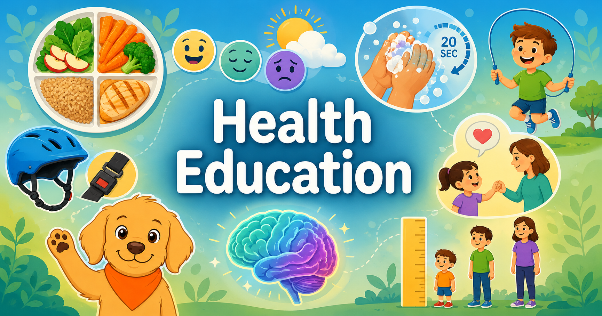

# Welcome

Welcome to **Health Education**, an interactive, intelligent textbook designed to empower K-12 students with knowledge and skills for lifelong health.

<figure markdown>
  { width="100%" }
</figure>

## About This Textbook

This comprehensive health education resource is organized by grade level, from Kindergarten through Grade 12, to ensure age-appropriate content and learning progression. Each grade band features carefully sequenced chapters that build foundational knowledge and critical health literacy skills.

## Explore by Grade Level

Start with your grade level to access courses, chapters, and interactive learning experiences:

- **[Kindergarten](bands/kindergarten/course-description.md)** — Health and safety fundamentals
- **[Grade 1](bands/grade-1/course-description.md)** — Foundations of health and safe habits
- **[Grade 2](bands/grade-2/course-description.md)** — Health basics, friendships, and feelings
- **[Grade 3](bands/grade-3/course-description.md)** — Wellness, safety, and trusted adults
- **[Grade 4](bands/grade-4/course-description.md)** — Nutrition, growth, and emotional health
- **[Grade 5](bands/grade-5/course-description.md)** — Personal health, wellness, and safety skills
- **[Grades 6-8](bands/grade-6-8/course-description.md)** — Health equity, relationships, and substance awareness
- **[Grades 9-12](bands/grade-9-12/course-description.md)** — Advanced health decision-making and advocacy

## How to Use This Textbook

### 📚 Chapters
Each grade level includes chapters organized around core health topics like nutrition, relationships, mental health, safety, and disease prevention. [Browse all textbooks by grade](bands/index.md).

### 🎮 Interactive MicroSims
Learn by doing! [Explore hundreds of interactive simulations](sims/index.md) that bring health concepts to life — from decision-making scenarios to visual concept maps to tracking tools.

### 🎨 Posters
Visual learning tools that reinforce key concepts. [View our poster collection](posters/index.md) designed for classroom display and student reference.

### 🗺️ Learning Graph Viewer
Explore the [interactive learning graph](sims/graph-viewer/index.md) to see how concepts connect and depend on each other across the curriculum.

## Key Features

✓ **Age-Appropriate Content** — Curriculum organized by developmental stage with content scaffolded for each grade level  
✓ **Interactive Learning** — MicroSims engage students through scenarios, games, decision trees, and visual exploration  
✓ **Visual Resources** — Posters, diagrams, and infographics support classroom teaching  
✓ **Concept Mapping** — Learning graphs show how ideas connect and build on each other  
✓ **Inclusive Design** — Culturally responsive content that honors diverse perspectives and experiences  

## Getting Started

1. **Choose Your Grade Level** — Select from Kindergarten through Grade 12 above
2. **Browse the Course** — Read the course description to see what topics are covered
3. **Work Through Chapters** — Each chapter combines text, MicroSims, and visual resources
4. **Use Interactive Tools** — Engage with MicroSims to practice skills and explore concepts

## Coming Soon

We're building additional resources including glossaries, FAQs, and comprehensive reference sections to support your learning journey.
