# Interactive Posters

These wide-landscape posters turn key health concepts into visual, classroom-ready learning experiences.

## Interactive infographic

[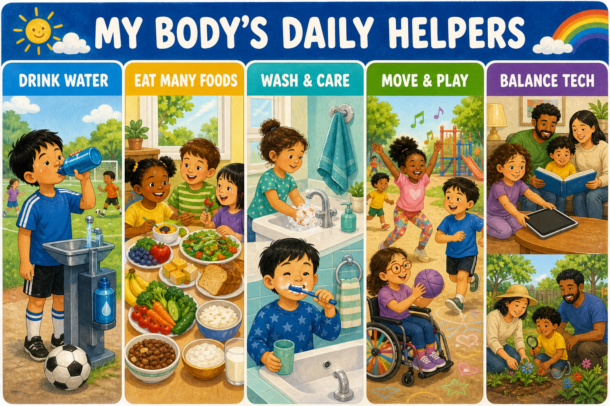](./my-bodys-daily-helpers/index.md)

### [My Body's Daily Helpers](./my-bodys-daily-helpers/index.md)

A Kindergarten Grid poster about hydration, varied foods, personal care, movement, and balanced technology use.

[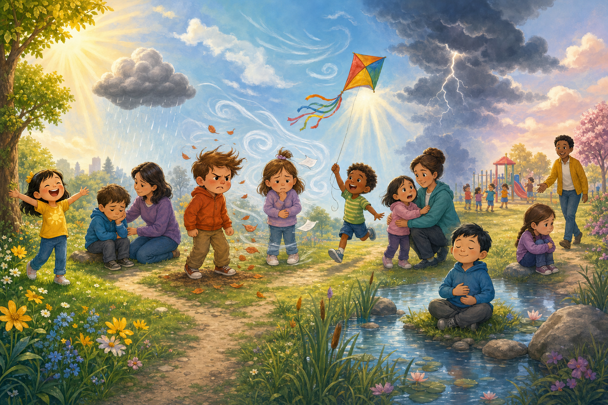](./feelings-weather-station/index.md)

### [Feelings Weather Station](./feelings-weather-station/index.md)

A Kindergarten Callout poster for naming eight feelings, noticing body clues, and asking trusted adults for help.

[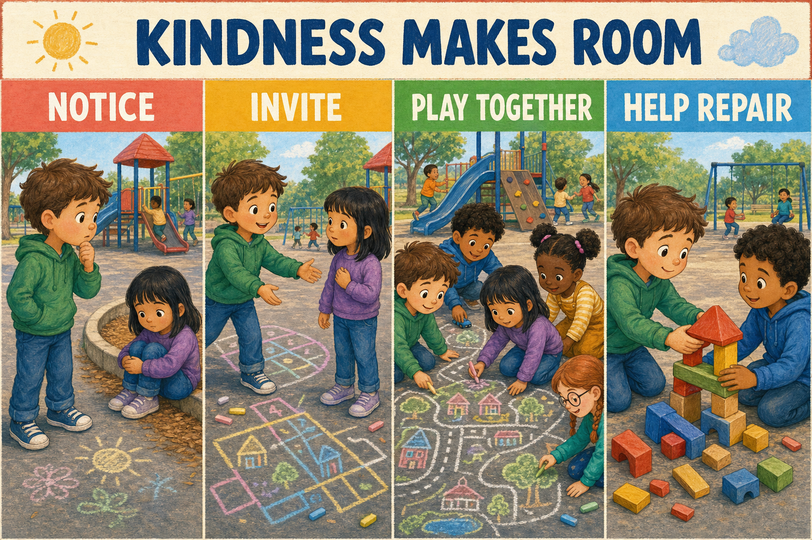](./kindness-makes-room/index.md)

### [Kindness Makes Room](./kindness-makes-room/index.md)

A Kindergarten Grid story about noticing, inviting, including, and repairing.

[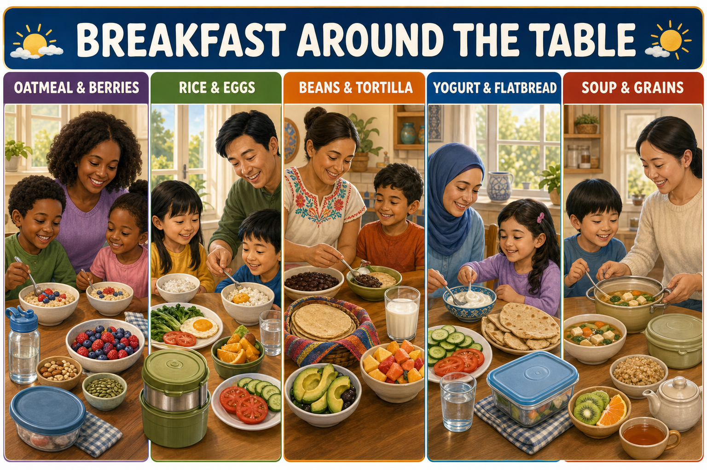](./breakfast-around-the-table/index.md)

### [Breakfast Around the Table](./breakfast-around-the-table/index.md)

A Grade 1 Grid poster celebrating breakfast variety, nourishing drinks, cultural food traditions, and safe storage.

[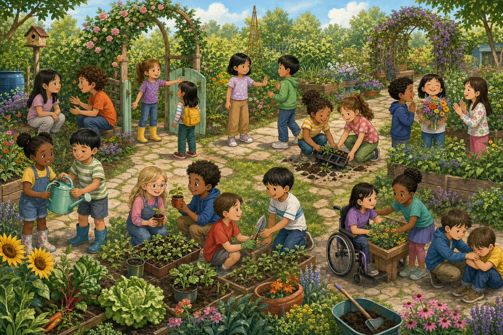](./friendship-garden/index.md)

### [Friendship Garden](./friendship-garden/index.md)

A Grade 1 Callout poster that grows ten healthy friendship traits through visible garden actions.

[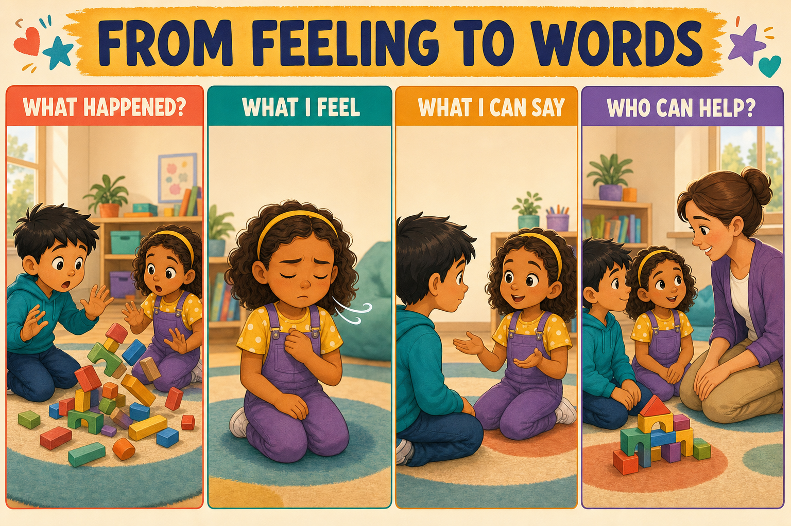](./from-feeling-to-words/index.md)

### [From Feeling to Words](./from-feeling-to-words/index.md)

A Grade 1 Grid poster for moving from an event and body clues to helpful words and trusted support.

[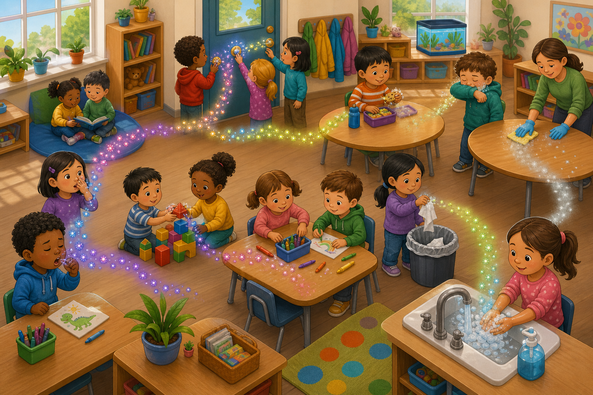](./germ-highway-roadblocks/index.md)

### [Germ Highway and Roadblocks](./germ-highway-roadblocks/index.md)

A Grade 1 Callout poster showing six germ routes and four hygiene roadblocks in one classroom.

[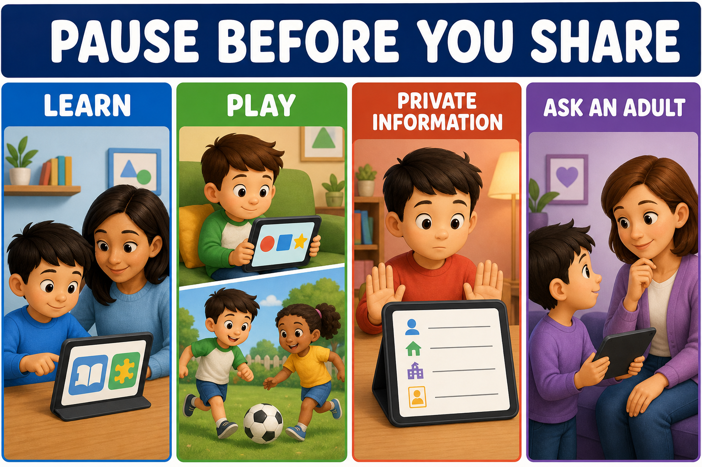](./pause-before-you-share/index.md)

### [Pause Before You Share](./pause-before-you-share/index.md)

A Grade 1 Grid poster about approved learning, balanced play, private information, and asking an adult.

[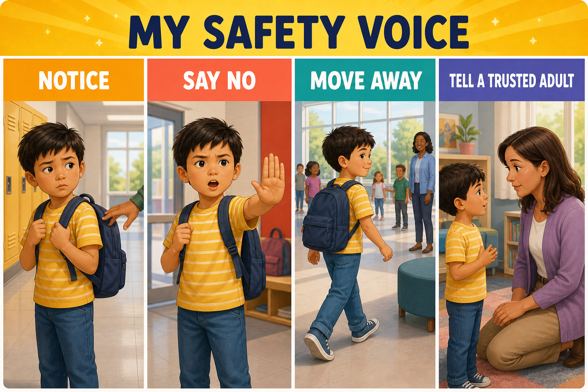](./my-safety-voice/index.md)

### [My Safety Voice](./my-safety-voice/index.md)

A calm Grade 1 Grid sequence for noticing discomfort, saying no, moving away, and telling a trusted adult.

[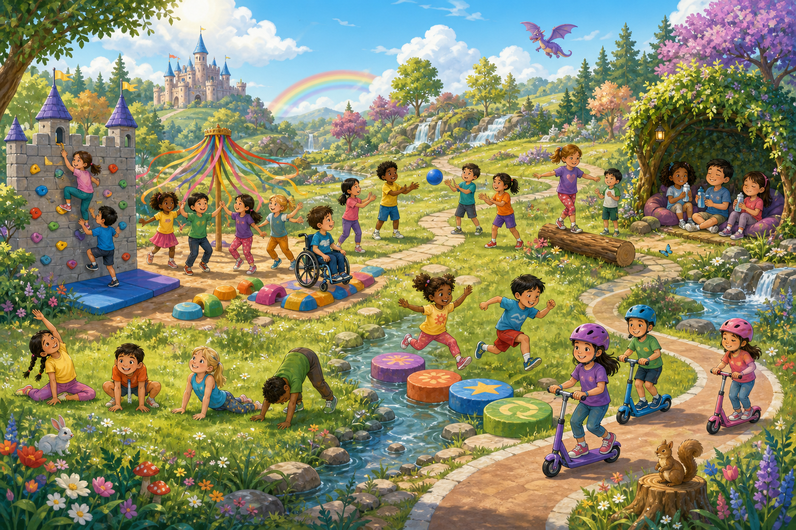](./active-play-adventure-park/index.md)

### [Active Play Adventure Park](./active-play-adventure-park/index.md)

A Grade 1 Callout poster connecting nine inclusive activities to strength, balance, focus, teamwork, joy, and recovery.

[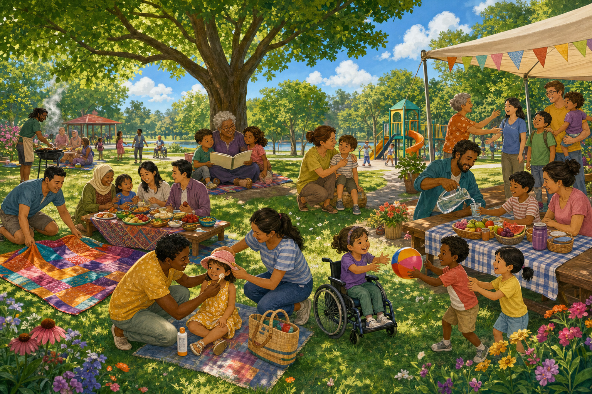](./families-many-ways-to-care/index.md)

### [Families: Many Ways to Care](./families-many-ways-to-care/index.md)

A Kindergarten Callout poster that explores family through observable acts of care, inclusion, comfort, safety, and welcome.

[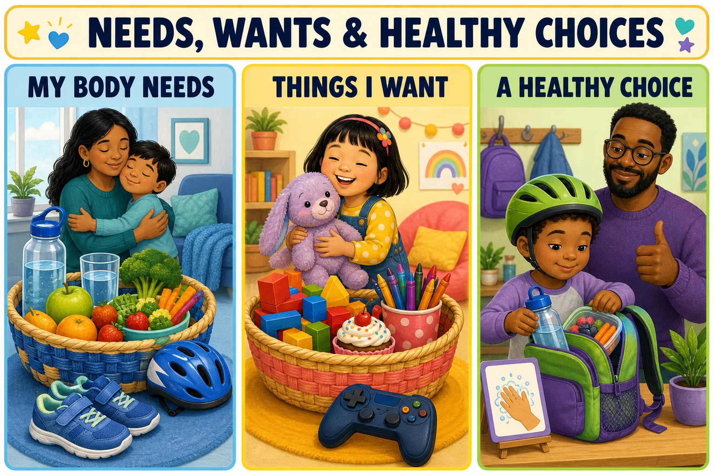](./needs-wants-healthy-choices/index.md)

### [Needs, Wants & Healthy Choices](./needs-wants-healthy-choices/index.md)

A Kindergarten Grid poster that distinguishes body needs, enjoyable wants, and one small healthy choice.

[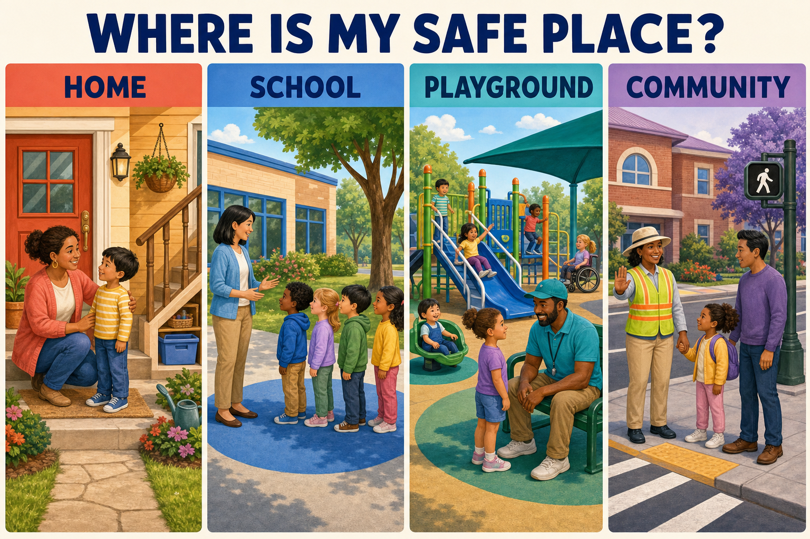](./where-is-my-safe-place/index.md)

### [Where Is My Safe Place?](./where-is-my-safe-place/index.md)

A Kindergarten Explore-and-Quiz poster about safety rules, trusted adults, and planned safe places at home, school, the playground, and in the community.

[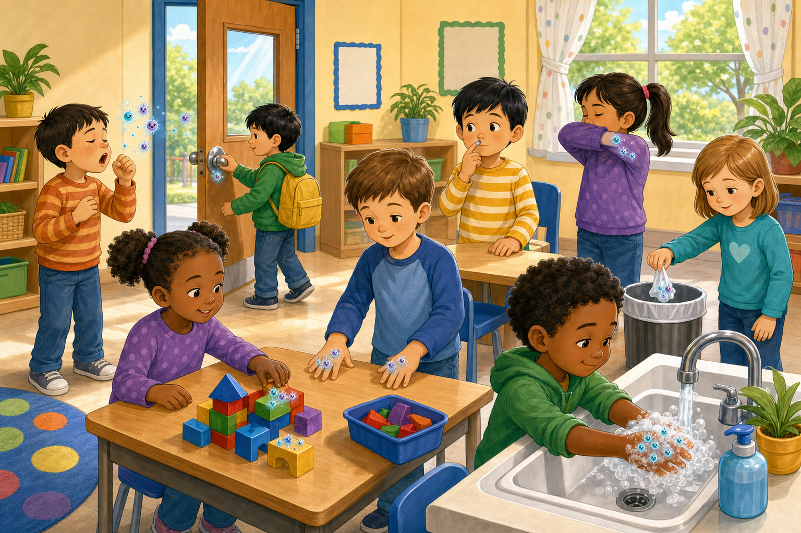](./germs-busy-day/index.md)

### [The Germ's Busy Day](./germs-busy-day/index.md)

A Kindergarten Explore-and-Quiz poster about how germs move through shared spaces and how handwashing and covered coughs stop their spread.

[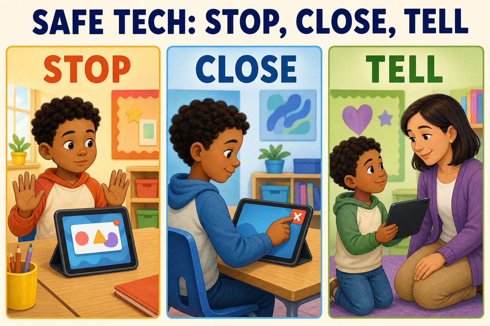](./safe-tech-stop-close-tell/index.md)

### [Safe Tech: Stop, Close, Tell](./safe-tech-stop-close-tell/index.md)

A Grade 2 Explore-and-Quiz poster for practicing what to do when something online feels unsafe, confusing, or uncomfortable.

## Additional posters

- [Food Groups](./food-groups/index.md)
- [Plate Proportions](./plate-proportions/index.md)
